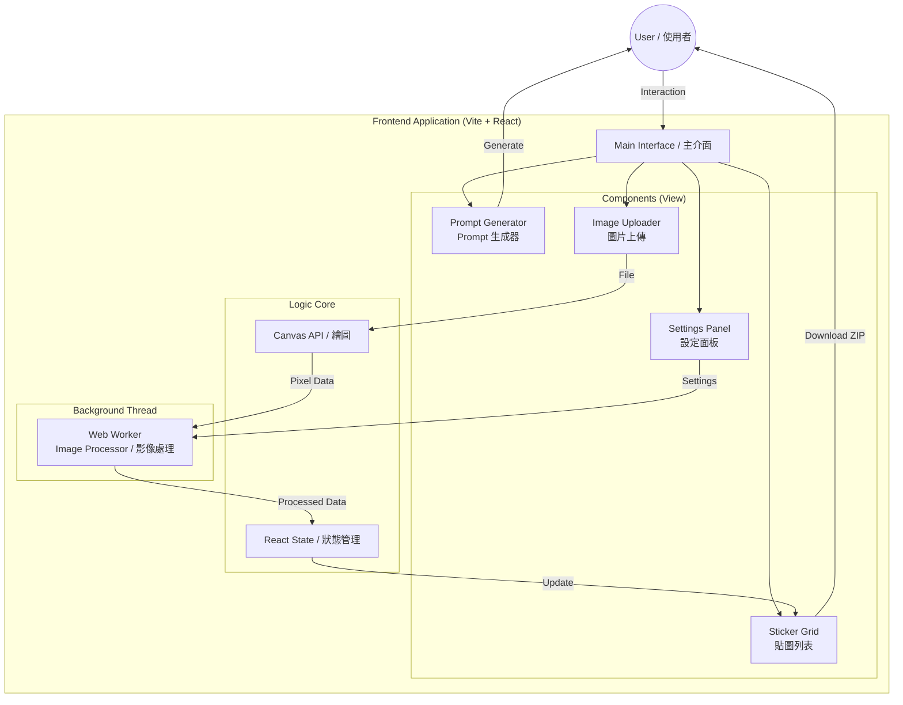

# Implementation Plan: Custom Line Sticker Factory / 客製化 Line 貼圖工廠實作計畫

## Goal / 目標
Create a client-side web application similar to "Line Sticker Factory" that allows users to generate prompts, slice images, and remove backgrounds for Line stickers.
建立一個類似 "Line 貼圖工廠" 的客戶端網頁應用程式，允許使用者生成提示詞、切割圖片並移除 Line 貼圖背景。


## Proposed Technology Stack / 建議技術棧
To ensure better maintainability and development experience, we will use a modern build tool instead of a single HTML file, while keeping the deployment serverless.
為了確保更好的維護性和開發體驗，我們將使用現代建置工具取代單一 HTML 檔案，同時保持無伺服器 (Serverless) 部署。

*   **Build Tool**: Vite (Fast, modern / 快速、現代)
*   **Framework**: React 18
*   **Language**: JavaScript / TypeScript (Recommended for robustness / 建議使用以提高穩固性)
*   **Styling**: Tailwind CSS
*   **Core Logic**: HTML5 Canvas + Web Workers (For image processing / 用於圖片處理)
*   **Utilities**: 
    *   `jszip`: For zipping files / 用於壓縮檔案
    *   `file-saver`: For downloading files / 用於下載檔案
    *   `lucide-react`: For icons / 用於圖示

## Features Breakdown / 功能細分

### 1. Prompt Generator (Prompt 生成器)
*   Select Theme (Daily, Holiday, etc.) / 選擇主題 (日常、節日等)
*   Select Style (Q-Version, Realistic, etc.) / 選擇風格 (Q版、寫實等)
*   Generate Copy-Paste Prompt for AI / 生成可複製給 AI 的提示詞

### 2. Image Processing Core (圖片處理核心)
*   **Upload**: Support 4x3 grid images / 支援 4x3 格狀圖片上傳
*   **Slicing (切片)**: Automatically slice 1 image into 12 distinct stickers / 自動將 1 張圖切成 12 張獨立貼圖
*   **Background Removal (去背)**: 
    *   Chroma Key (Green Screen removal) / 綠幕去背
    *   Adjustable Tolerance & Smoothness / 可調整容許度與平滑度
    *   Web Worker implementation to prevent UI freezing / 使用 Web Worker 避免 UI 卡頓

### 3. UI/UX
*   Modern, Dark Mode aesthetic / 現代化深色模式美學
*   Real-time preview / 即時預覽


## Architecture Diagram / 架構圖



## Project Structure / 專案結構
```
/src
  /components
    PromptGenerator.jsx  (Prompt Settings / Prompt 設定)
    ImageUploader.jsx    (Upload & Preview / 上傳與預覽)
    StickerGrid.jsx      (Result Display / 結果顯示)
    SettingsPanel.jsx    (Chroma Key Settings / 去背設定)
  /workers
    imageProcessor.js    (Background processing / 背景處理)
  /utils
    canvasUtils.js       (Slicing logic / 切片邏輯)
  App.jsx
```

## Step-by-Step Implementation / 實作步驟

### Phase 1: Setup & Foundation / 第一階段：設定與基礎
1.  Initialize Vite project with React & Tailwind CSS.
    初始化 Vite 專案 (React + Tailwind CSS)。
2.  Set up the basic layout and UI components (Header, Footer, Main Layout).
    設定基本佈局與 UI 元件 (頁首、頁尾、主要佈局)。

### Phase 2: Prompt Generator / 第二階段：Prompt 生成器
1.  Implement the data structure for Themes and Styles.
    實作主題與風格的資料結構。
2.  Create the UI to select options and generate the string.
    建立選擇選項並生成字串的 UI。

### Phase 3: Core Image Logic / 第三階段：圖片核心邏輯
1.  Implement Image Upload & Canvas rendering.
    實作圖片上傳與 Canvas 渲染。
2.  Implement "Slicing" logic (4 cols x 3 rows).
    實作 "切片" 邏輯 (4 欄 x 3 列)。
3.  Set up Web Worker for pixel manipulation (Background Removal).
    設定 Web Worker 進行像素處理 (背景移除)。

### Phase 4: Refinement & Export / 第四階段：優化與匯出
1.  Integrate `jszip` for batch download.
    整合 `jszip` 進行批次下載。
2.  Polish UI/UX (Loading states, animations).
    打磨 UI/UX (載入狀態、動畫)。
3.  Add bilingual comments/help in the code.
    在程式碼中加入雙語註解/說明。

## Verification Plan / 驗證計畫
*   [ ] Verify Prompt generation format matches expectation. / 驗證 Prompt 生成格式符合預期。
*   [ ] Verify Image Slicing produces 12 correct images. / 驗證圖片切片產生 12 張正確圖片。
*   [ ] Verify Green Screen removal works on test images. / 驗證綠幕去背功能在測試圖片上運作正常。

## Deployment Strategy / 部署策略

Since this is a client-side only (Static) application, we have several excellent free hosting options.
由於這是一個純客戶端 (靜態) 應用程式，我們有多個優秀的免費託管選項。

### 1. GitHub Pages (Recommended / 推薦)
*   **Pros**: Completely free, integrated with your code repository, no extra account needed.
*   **Cons**: Basic features, slightly slower build time than Vercel.
*   **Best for**: Open source projects, personal tools.
*   **優點**: 完全免費，與程式碼倉庫整合，不需額外帳號。
*   **缺點**: 功能較基礎，建置時間稍慢於 Vercel。
*   **適合**: 開源專案、個人工具。

### 2. Vercel
*   **Pros**: Optimized for React/Vite, incredibly fast global CDN, automatic SSL, zero-config.
*   **Cons**: Free tier has limits (generous though).
*   **Best for**: Production-grade performance, ease of use.
*   **優點**: 針對 React/Vite 優化，極快的全球 CDN，自動 SSL，零配置。
*   **缺點**: 免費版有使用限制 (但很寬鬆)。
*   **適合**: 用戶級效能、易用性。

### 3. Netlify
*   **Pros**: Drag-and-drop deployment, very stable, good form handling support.
*   **Cons**: Build minutes limits on free tier.
*   **Best for**: Quick prototypes, sites needing simple backend functions.
*   **優點**: 支援拖拉部署，非常穩定，良好的表單處理支援。
*   **缺點**: 免費版有建置時間限制。
*   **適合**: 快速原型、需要簡單後端功能的網站。

### 4. Cloudflare Pages
*   **Pros**: Runs on Cloudflare's massive edge network (fastest), unlimited bandwidth.
*   **Cons**: Setup can be slightly more complex for beginners.
*   **Best for**: High traffic sites, performance purists.
*   **優點**: 運行在 Cloudflare 的龐大邊緣網路上 (最快)，無限頻寬。
*   **缺點**: 對初學者來說設定稍顯複雜。
*   **適合**: 高流量網站、效能追求者。

## AI Service Dependency / AI 服務依賴說明
**No, this website does NOT call any external AI services directly.**
**不，這個網站不會直接調用任何外部 AI 服務。**

*   **Prompt Generation**: Uses internal templates to generate text strings. No AI involved.
    *   **Prompt 生成**: 使用內部模板生成文字字串，不涉及 AI。
*   **Image Generation**: Users copy the prompt and generate images **externally** (e.g., using Midjourney, DALL-E).
    *   **圖片生成**: 使用者複製 Prompt 後，**在外部** (如 Midjourney, DALL-E) 生成圖片。
*   **Image Processing**: Uses standard algorithms (Math) for background removal, not AI models.
    *   **圖片處理**: 使用標準演算法 (數學計算) 進行去背，而非 AI 模型。

**Benefit**: Zero API cost, no privacy concerns, works offline (after initial load).
**優點**: 零 API 成本，無隱私疑慮，可離線使用 (載入後)。

## Source Control & Sync Strategy / 原始碼同步與版控策略

To manage the source code effectively and enable collaboration/deployment, we will use **Git** and **GitHub**.
為了有效管理原始碼並啟用協作/部署，我們將使用 **Git** 與 **GitHub**。

### 1. Version Control System (Git) / 版本控制系統
*   **Initialize**: Run `git init` in the project root.
*   **Ignore**: Create `.gitignore` to exclude `node_modules`, `.env`, and build artifacts.
*   **Commit**: Save progressive changes.

### 2. Remote Repository (GitHub) / 遠端倉庫
*   **Create Repo**: Create a new empty repository on GitHub (e.g., `line-sticker-factory`).
*   **Link**: Connect local folder to GitHub remote. (`git remote add origin ...`)
*   **Sync**: Push changes to the cloud. (`git push -u origin main`)

### 3. Workflow / 工作流程
1.  **Code**: Make changes in `src/`.
2.  **Test**: Run `npm run dev` to verify.
3.  **Commit**: `git add .` -> `git commit -m "Update feature"`
4.  **Sync**: `git push` (Automatically triggers deployment if linked to GitHub Pages/Vercel).

This ensures your code is always backed up and ready for deployment.
這確保您的程式碼隨時都有備份，並且準備好進行部署。


