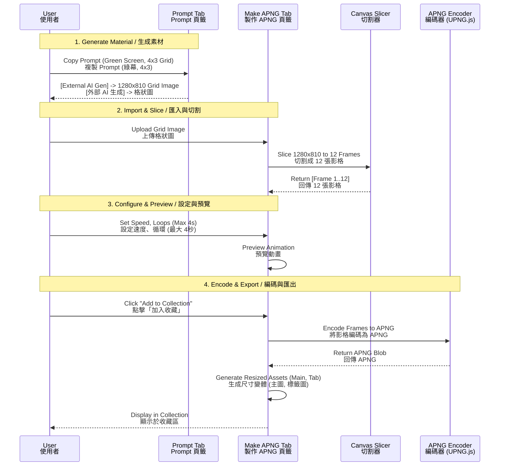

# Implementation Plan v4: Simplified Line Dynamic Sticker Tool / v4 簡易版實作計畫

## Goal / 目標
Create a streamlined tool specifically for generating LINE Dynamic Stickers (APNG) using AI-generated **4x3 grid images**.
建立一個簡化的工具，專門用於使用 AI 生成的 **4x3 格狀圖片** 來製作 LINE 動態貼圖 (APNG)。

## Core Features / 核心功能

### 1. Tab: Dynamic Sticker Prompt / 動態貼圖 Prompt
*   **Function**: Generate a prompt for external AI (e.g., Midjourney/DALL-E) to create the source grid image.
*   **Input**:
    *   **Sticker Picker**: Select a reference emotion/sticker.
    *   **Style**: "Sticker Style" with white outline.
*   **Output Prompt Specification**:
    *   **Layout**: 4x3 Grid (Total 12 frames).
    *   **Dimensions**: Total 1280x810 px (Sub-images ~320x270 px).
    *   **Background**: Pure Green (#00FF00) for easy chroma keying.
    *   **Consistency**: Maintain character appearance across frames.
    *   **Padding**: ~0.2cm padding between frames to prevent overlapping.

### 2. Tab: Make APNG / 製作 APNG
*   **Upload Area**: 
    *   Accepts the **4x3 Grid Image** generated above.
*   **Auto Split (Core Logic)**:
    *   Automatically slices the 1280x810 image into **12 frames** (320x270 each).
*   **Workspace (Editor)**:
    *   **Sequence Editor**: Arrange the 12 frames (or subset, min 5, max 20).
    *   **Animation Settings**:
        *   **Loop Count**: 1-4 times.
        *   **Max Duration**: 4 seconds.
    *   **Preview**: Real-time playback of the APNG.
*   **Collections (Output Zone)**:
    *   **Sticker Collection**: List of created APNGs (320x270 px).
    *   **Other Assets**:
        *   **Main Image**: 240x240 px (Auto-resized from APNG frame).
        *   **Tab Image**: 96x74 px (Auto-resized from APNG frame).
    *   **Actions**: Clear All, Download All.

## UML Sequence Diagram / 循序圖

## Step-by-Step Plan / 實作步驟

### Phase 4.1: Infrastructure (Same) / 基礎設施
1.  Install `upng-js`.
2.  Update `task.md`.

### Phase 4.2: Dynamic Prompt Tab / Prompt 頁籤
1.  Create `DynamicPromptGenerator.jsx`.
2.  Implement logic to construct the specific "4x3 Green Screen" prompt string.

### Phase 4.3: APNG Maker Core / APNG 製作核心
1.  Create `APNGMaker.jsx`.
2.  Reuse `CanvasUtils` to slice 4x3 inputs (ensure 1280x810 support).
3.  Implement `APNGBuilder` using `UPNG.js` to combine sliced frames.

### Phase 4.4: Collection & Export / 收藏與匯出
1.  State management for "Sticker Collection".
2.  Logic to auto-resize generic frames to "Main (240px)" and "Tab (96px)" sizes.
3.  Implement "Download" (Individual and Zip).
