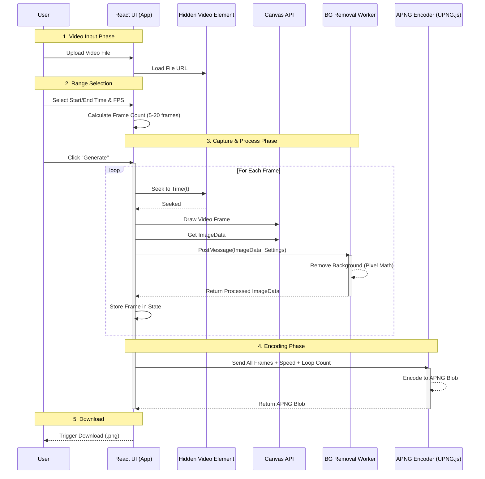

# Implementation Plan v4: Line Dynamic Sticker Tool / LINE 動態貼圖工具實作計畫

## Goal / 目標
Build upon the v3 RWD foundation to support **LINE Dynamic Stickers (APNG)** creation. The tool will allow users to generate animated stickers from either a 3x3 grid image or a video file, fully client-side.
在 v3 RWD 的基礎上，新增 **LINE 動態貼圖 (APNG)** 製作功能。工具將允許使用者透過 九宮格圖片 或 影片檔案 生成動態貼圖，且完全在前端運作。

## Core Features / 核心功能
1.  **Dual Input Modes / 雙輸入模式**:
    *   **Grid Mode**: Import 3x3 grid image -> Slice -> Sequence.
    *   **Video Mode**: Import Video -> Extract Frames -> Sequence.
2.  **Frame Processing / 影格處理**:
    *   Batch Background Removal (Green Screen).
    *   Preview Animation (Play/Pause, Speed Control).
3.  **APNG Export / APNG 匯出**:
    *   Client-side encoding using `UPNG.js` (or similar).
    *   Compliance with LINE specs (Max 4s, Loop count, <300KB/file preferred).

## UML Sequence Diagram / 循序圖
The following diagram illustrates the **Video Mode** workflow, which is the most complex new feature.

## Architecture Changes / 架構變更

### 1. New Dependency
*   **UPNG.js**: For generating APNG files.
    *   *Why*: Lightweight, pure JS, supports APNG encoding.

### 2. Component Updates
*   **`ImageUploader.jsx`**: Needs tabs for "Static Image" vs "Video".
*   **`StickerGrid.jsx`**: Needs a "Preview Mode" to play the animation instead of just showing static images.
*   **`SettingsPanel.jsx`**: Add Animation controls (FPS, Duration, Loop).

### 3. Worker Enhancements (`imageProcessor.js`)
*   Current: Processes single image.
*   Update: No change needed to the *logic*, but the *Consumer* (App.jsx) needs to handle the loop of sending multiple frames.
*   *Optimization*: Consider transferring `ArrayBuffer` to avoid cloning overhead if performance lags.

## Step-by-Step Plan / 實作步驟

### Phase 4.1: Preparation / 準備工作
1.  Install `upng-js` (or copy library file if no npm package).
2.  Update `task.md` with detailed v4 tasks.

### Phase 4.2: Video Input & Capture / 影片輸入與截取
1.  Add Video Input UI.
2.  Implement `VideoFrameExtractor` utility:
    *   Takes video URL + config.
    *   Returns array of `ImageData`.

### Phase 4.3: Batch Processing / 批次處理
1.  Update App state to hold an *Array* of frames (instead of single image).
2.  Implement "Batch Processing" loop to send frames to Worker.

### Phase 4.4: APNG Encoding / APNG 編碼
1.  Implement `APNGGenerator` utility using UPNG.js.
2.  Connect "Download" button to APNG generation.

### Phase 4.5: Validation / 驗證
1.  Verify generated APNG works in LINE (or Chrome/Firefox).
2.  Check file size limits.
