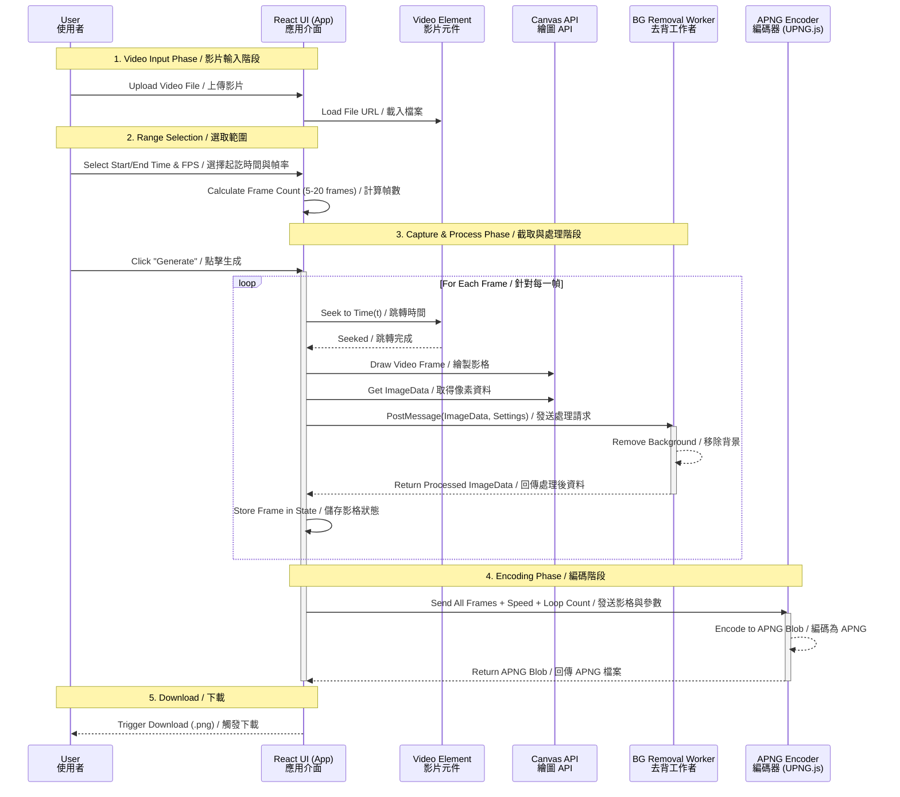

# v4 Analysis: Line Dynamic Stickers Tool
# v4 分析：LINE 動態貼圖製作工具

**Reference / 參考網站**: [https://steachs.com/tools/line_dynamic_stickers/](https://steachs.com/tools/line_dynamic_stickers/)

## 1. Core Features / 核心功能
*   **Target Output / 目標輸出**: 
    *   **APNG (Animated PNG)**: The required format for LINE dynamic stickers.
    *   **9-Grid Slicing / 九宮格切割**: Slices a 3x3 grid into individual images (for static stickers or manual APNG creation).
*   **Input Support / 輸入支援**:
    *   **3x3 Grid Image / 九宮格圖片**: Single image containing 9 frames.
    *   **Video Files / 影片檔案**: .mp4, .mov, .webm.
*   **Privacy / 隱私**:
    *   **Client-side Processing / 前端處理**: All processing (slicing, background removal, encoding) happens in the browser. No server upload.

## 2. Detailed Workflow / 詳細操作流程
The tool provides two distinct workflows based on the source material.
工具根據素材來源提供兩種不同的工作流程。

### Mode A: Grid Source (九宮格模式) - *As shown in video ~360s*
1.  **Prep**: User prepares a single image (PNG/JPG) containing a 3x3 grid of frames.
    *   *Constraint*: Total 9 frames. Order: Left-to-right, Top-to-bottom.
2.  **Upload**: Select "Grid Input".
3.  **Preview & Config**:
    *   System slices the image into 9 frames.
    *   User adjusts **Speed (Duration)** and **Loop Count**.
4.  **Background Removal (Optional)**: Toggle "Remove Background".
5.  **Generate**: Click "Make APNG". System combines frames into `.png`.

### Mode B: Video Source (影片模式)
1.  **Prep**: User has a short video file (MP4/MOV).
2.  **Upload**: Select "Video Input".
3.  **Capture**:
    *   User plays video and selects a "Start Time" and "End Time" (or duration).
    *   System captures frames at a set interval (FPS) to fit within LINE's 4-second limit.
    *   *Constraint*: Must capture minimum 5 frames, max 20 frames (Line spec).
4.  **Processing**:
    *   **Frame Extraction**: Video -> Canvas ImageBitmap -> Array of Frames.
    *   **Background Removal**: Applied to each captured frame.
5.  **Generate**: Compile selected frames into APNG.

## 3. Technical Architecture for v4 / v4 技術架構
To implement this in our React application:

### A. Core Libraries
*   **UPNG.js (or similar)**: For encoding APNG binary data client-side. *Critical dependency*.
*   **FFmpeg.wasm (Optional but heavy)**: For robust video handling.
    *   *Alternative*: Use HTML5 `<video>` + `<canvas>` `drawImage()` for lightweight frame extraction (Recommended).

### B. Worker Strategy
*   **ImageProcessor.worker.js (Existing)**:
    *   Current: Handles 1 image (Grid).
    *   **Upgrade**: Needs to accept an *Array* of ImageBitmaps (Frames) and process them in batch or sequentially.
    *   New Action: `PROCESS_FRAMES` (takes `[Frame1, Frame2...]`, returns `[Processed1, Processed2...]`).

### C. Data Flow
1.  **Input**: `<input type="file" accept="video/*,image/*">`
2.  **Manager**: `StickerGenerator` component determines mode.
3.  **Video Mode**:
    *   Hidden `<video>` element loads file.
    *   User seeks -> captures frames to Canvas.
    *   Frames sent to Worker -> BG Removal.
    *   Clean frames sent to UPNG.js -> Blob.
4.  **Output**: User downloads `.png` (APNG content).

---
**Conclusion / 結論**:
v4 will focus on **Dynamics (Animation)**. The core added value is the **APNG Generator** that works fully client-side.
v4 將專注於 **動態 (動畫)**。核心附加價值在於完全前端運作的 **APNG 生成器**。

---

## Appendix: Archived Initial v4 Plan (Video Mode) / 附錄：已存檔的初始 v4 計畫 (影片模式)
*This section contains the initial plan which included Video Mode. It is preserved for reference.*
*本節包含初始的 v4 計畫 (含影片模式)，保留供參考。*

### UML Sequence Diagram (Archived) / 循序圖 (存檔)

